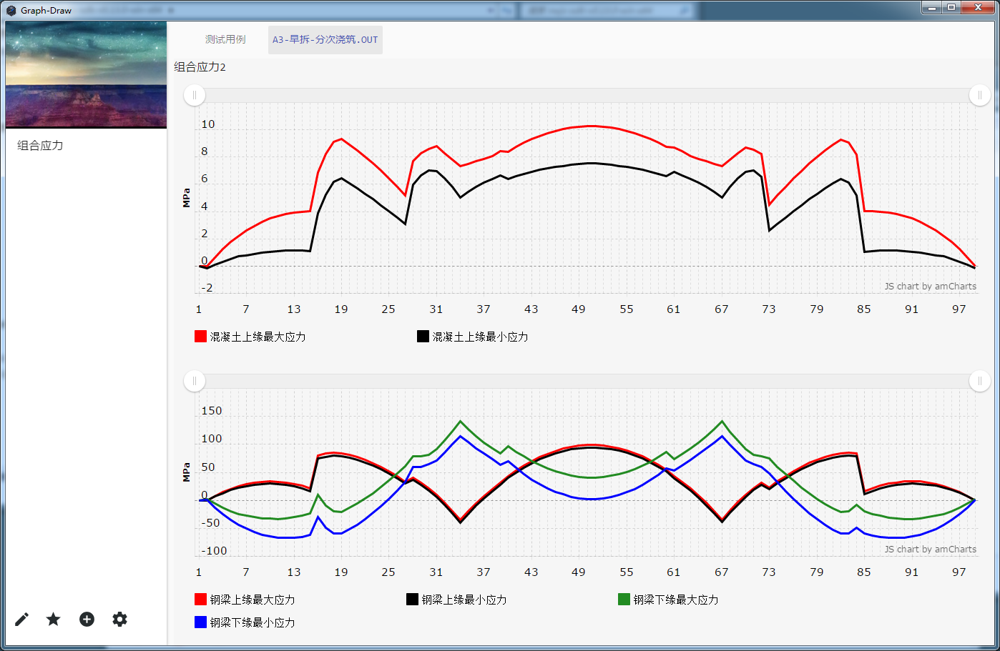
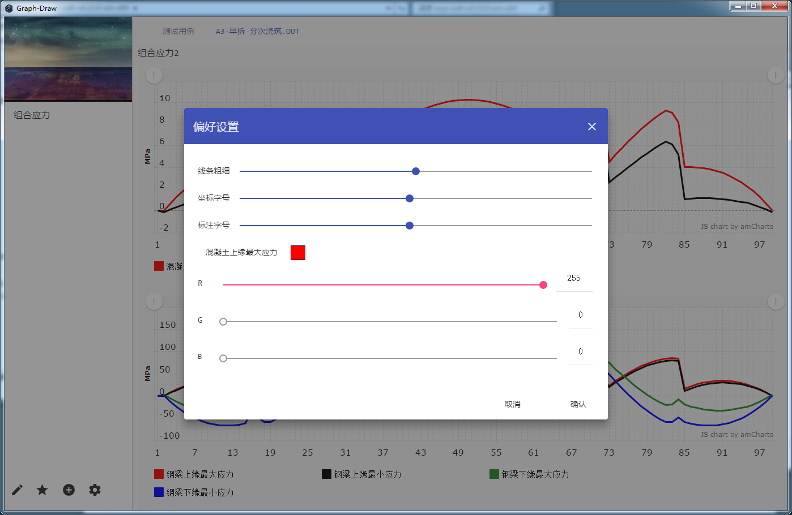

#Graph-Draw
##Overview
* This is a application used for drawing graphs from data which is produced by a program used for designing bridge
* Use nw.js(13.0) and angularjs
* MIT liscence

##Preparation
* you should have installed git and nodejs
* git clone
* cd Graph-draw,npm install
* npm -g install bower
* cd /app,bower install

##Screenshot
* normal
 
* setting
  